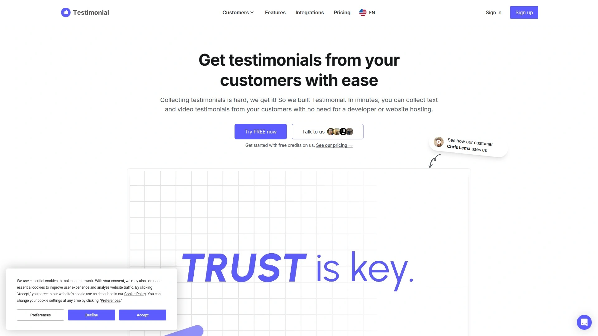
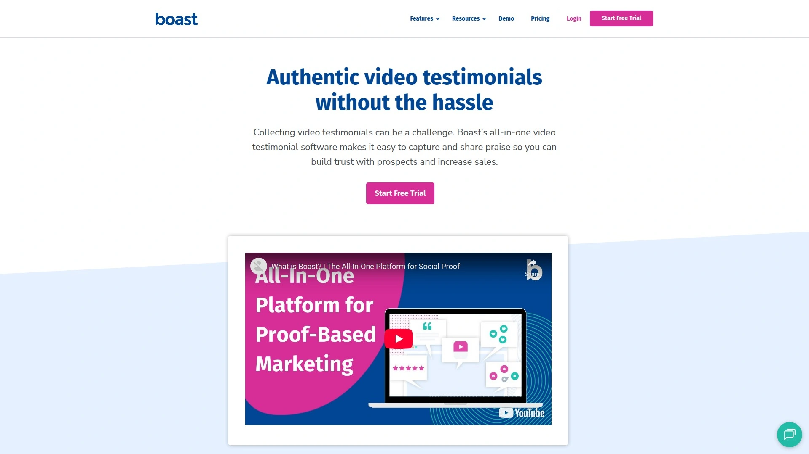

# Learn These 10 Testimonial Collection Software, Complete Social Proof Building in Minutes

Asking customers for reviews shouldn't feel like pulling teeth. You know testimonials boost conversions by 80%, but chasing down feedback, recording videos, editing clips, and embedding them on your website eats hours you don't have. Video testimonial software automates the entire workflow—from sending customized requests to publishing polished social proof across your site—turning what used to take weeks into a task you finish during lunch. Whether you're a solopreneur building credibility from scratch, a SaaS team needing case studies, or an agency managing client reviews, these platforms collect authentic customer voices and display them where they'll actually drive sales.

Modern testimonial collection tools support both text and video submissions through mobile-friendly forms that customers complete in under three minutes. Most platforms provide unlimited storage, automated transcription, and no-code embedding widgets that drop into any website. You get Wall of Love pages showcasing all reviews in one branded space, automated follow-up sequences increasing response rates, and social media import features pulling praise from Twitter, LinkedIn, and Facebook. Pricing ranges from completely free plans to under $50 monthly for full-featured options, with many offering 14-day trials so you test before committing.

***

## **[Testimonial](https://testimonial.to)**

Straightforward collection and embedding focused on getting testimonials live fast.

Testimonial emerged as the go-to choice for businesses wanting powerful yet simple customer review software. The platform excels by focusing on authentic collection of both video and text testimonials—critical assets for building social proof that converts browsers into buyers. What sets it apart is dedication to video content, a format fostering deeper connection and trust than text alone.

Customers record and submit testimonials directly from browsers or phones without downloading special software. This simplicity on the user end significantly increases submission rates, providing steady streams of authentic high-impact content. You create a single shareable link and include it in email signatures, post-purchase follow-ups, or social media campaigns. All submitted testimonials organize in one dashboard where you easily manage, tag, and select the best reviews for different marketing channels.

The Wall of Love feature lets you showcase testimonials on any website with simple embed codes, creating beautiful dynamic displays or embedding individual reviews on product pages to boost conversions. Beyond simple reviews, the platform offers tools structuring more in-depth narratives through case study generation. You can add testimonials to websites with no coding whatsoever.

Testimonial translation supports many languages, making it accessible for international businesses. The platform provides both free and paid tiers, though it can become expensive as you grow since you pay for each additional space or project. The dashboard complexity receives occasional criticism for not being as easy to navigate as some competitors. However, the core functionality of collecting video and text testimonials and sharing them via widgets remains solid.

***

## **[Senja](https://senja.io)**

Feature-rich free option with exceptional UX and unlimited testimonial storage.

Senja positions itself as the best free video and text testimonial collection software allowing you to collect, manage, and share unlimited testimonials. The platform earns high regard for exceptional user experience and top-notch customer support, with users consistently praising work on these aspects. What truly differentiates Senja is unique ways of sharing customer testimonials through countless customizable widgets embeddable on any website.

You get Walls of Love, popups, images, and animations making it easy to showcase customer testimonials in engaging ways that drive conversions. The platform supports 26 external testimonial sources with auto-sync support for 11 platforms, ensuring you centralize all social proof in one place. This means pulling reviews from Twitter, LinkedIn, Google, Facebook, and other channels happens automatically.

Collection happens through customizable forms where customers submit text or video testimonials in minutes without friction. Video testimonials export in HD on any paid plan, and the platform includes analytics tracking testimonial views, engagements, clicks, rates, and submissions. AI analysis discovers insights hidden in your social proof, helping you understand what customers truly value.

Senja provides video trimming but lacks advanced video editing features currently. However, even with a dedicated video editor tool, it still costs less than competitors offering video editing while providing more display options and import sources. Unlimited video and text responses come with any paid plan, making it generous compared to platforms limiting monthly testimonial counts. The free plan gives you solid foundation to start collecting and displaying testimonials immediately.

***

## **[Famewall](https://famewall.io)**

Affordable startup-friendly platform with unlimited text testimonials and social media imports.

Famewall built its reputation on being the complete testimonial software packed with features at really affordable prices. It solves problems entrepreneurs face collecting, managing, and sharing testimonials while maintaining pricing that doesn't hurt. The founder created it after facing frustrations in previous businesses, then shipped features based on customer feedback.

Custom collection pages include optional video messages making requests feel more personal, which increases likelihood of receiving enthusiastic video testimonials. Customers decide between text or video testimonials, entering details and submitting in few clicks. For video testimonials, they select camera and audio sources, hit record, redo multiple takes if needed, and submit—Famewall handles all hosting and sends notifications when testimonials arrive.

You can import testimonials from 15+ platforms including Twitter, LinkedIn, Reddit, Google Reviews, and Facebook by simply pasting links. This flexibility lets you convert positive brand mentions across social media into testimonials displayed in attractive formats. Organizing testimonials into categories helps when you have many reviews and want to filter by "compliments" or "critical feedback" to extract maximum value.

Generating images from testimonials takes just clicks, and these images share easily across social media like Twitter, LinkedIn, Instagram, Facebook, and Stories for marketing purposes. While Boast.io's Basic Plan starts at $50 monthly, Famewall pricing runs as low as $9.99 monthly while delivering comparable or superior value. You collect unlimited text testimonials on all plans with no upper limits unlike competitors restricting monthly submissions.

---

## **[Boast](https://boast.io)**

Video-focused testimonial collection with emphasis on ease and marketing optimization.

Boast built an all-in-one video testimonial software making it easy to capture and share praise so you build trust with prospects and increase sales. The platform focuses primarily on helping collect best video testimonials with minimal hassle. You create testimonial collection forms, though Boast allows only video testimonials rather than offering text options.

The service helps businesses gather, manage, and showcase customer testimonials through streamlined processes designed for speed. Once collected, videos can be edited and distributed across multiple marketing channels to maximize impact. Boast integrates with various platforms making it easy to embed testimonials on websites, share via social media, or include in email campaigns.

User-friendly interfaces ensure both businesses and customers find the experience smooth. Customers receive simple links leading to recording pages where they submit videos from any device. The platform stores submissions centrally where you review, organize, and select best testimonials for different purposes.

Pricing starts at $50 monthly for Basic plans, positioning it in mid-range compared to budget and premium options. The platform limits testimonials collected monthly to 50 total submissions, which may constrain businesses with high volumes. For companies specifically wanting video-only testimonials and willing to pay moderate prices, Boast delivers focused functionality.

***

## **[VideoAsk](https://www.videoask.com)**

Interactive video conversations enabling personalized testimonial requests and asynchronous responses.

VideoAsk by Typeform brings interactive video functionality to testimonial collection, letting you create personalized video requests customers respond to asynchronously. Rather than static forms, you record video messages asking specific questions, and customers reply with their own videos. This human-to-human approach feels more authentic and personal than text-only surveys.

The platform makes it easy for customers to talk about experiences without feeling intimidated by formal testimonial requests. Simple interfaces guide them through recording responses on any device. You can create pre-set Q&A-based video surveys, use multiple templates, and access strong personalization options.

VideoAsk integrates with tools like HubSpot, Mailchimp, and Zapier for workflow automation. However, it focuses primarily on video interactions rather than comprehensive testimonial management, meaning it lacks some features specific to organizing and displaying collected testimonials. The platform doesn't offer advanced video editing capabilities found in specialized testimonial tools.

Pricing is based on video minutes processed, which can become expensive for high-volume users. Mobile-optimized forms ensure customers on phones have good experiences. VideoAsk excels at facilitating engaging video interactions and feedback collection but may require supplementary tools for full testimonial showcase capabilities. It's particularly strong for businesses prioritizing conversational collection over static testimonial displays.

***

## **[Trustmary](https://trustmary.com)**

Review showcase platform optimizing testimonials for lead generation and conversions.

Trustmary positions itself as reliable and efficient video testimonial software offering businesses means to bolster online reputation and credibility. The platform provides tools for collecting, analyzing, and publishing real customer experiences efficiently. Interactive video players, multi-channel distribution options, and real-time analytics simplify showcasing authentic customer feedback.

The service integrates smoothly with review sites and offers customizable forms making it valuable for businesses strengthening brands through compelling testimonials. You collect video and text reviews, then optimize how they display to maximize conversion impact. Trustmary excels at turning collected testimonials into lead generation tools rather than just social proof displays.

User-friendly interfaces help teams navigate the platform without steep learning curves. The focus stays on efficiency—getting testimonials collected, organized, and published quickly so they start driving results. Multi-channel distribution means publishing testimonials across websites, social media, and email campaigns from single dashboards.

While Trustmary provides fewer video customization options compared to video-editing-focused competitors, it compensates with conversion optimization features. The platform lacks free plan options, requiring paid subscriptions from the start. Initial navigation might present slight learning curves, though most users adapt quickly. For businesses prioritizing testimonials that directly generate leads over creative video production, Trustmary delivers focused value.

***

## **[Trust](https://usetrust.io)**

Versatile automated solution with AI testimonial generator and affordable pricing.

Trust (formerly known as Trust.io) provides comprehensive testimonial and review solution covering collection through display and optimization. The platform stands out for rich UI, advanced editor, affordable pricing, and unique AI testimonial generator streamlining how customers write testimonials. You can create interactive forms that feel conversational rather than transactional.

The AI testimonial generator helps customers who struggle with writing by suggesting content based on their responses, making submission easier and increasing completion rates. Interactive forms include built-in AI assistance guiding customers through creating high-quality feedback. You add supportive guidelines to question series ensuring you receive testimonials covering important topics.

Auto-transcribe testimonial videos and generate subtitles, then save these logo-free videos for any purpose. Import and add links to clients' social media profiles or review sources, quickly showing prospects you're legitimate. All testimonials and external reviews manage from single dashboards eliminating clutter. The collection of widgets, pop-up notifications, and Wall of Love pages beautify landing pages.

Step-by-step guides help non-tech-savvy users publish and embed videos or forms on desired platforms. Easy integration works with CMS platforms like HubSpot and website builders including Wix and WordPress. Trust consistently receives praise for being highly optimized, feature-rich, and affordable—ideal for SMBs wanting professional results without enterprise budgets. Consent checkboxes built into all forms ensure you never worry about sharing videos publicly without permission.

***

## **[StoryPrompt](https://www.storyprompt.com)**

Automated video production with AI editing removing filler words and awkward silences.

StoryPrompt revolutionizes video testimonial creation through automatic video production that stitches responses together creating seamless video experiences. Clever AI removes awkward silences and filler words, producing polished videos minutes after replies arrive. This automation eliminates tedious manual editing that traditionally consumes hours.

You create text or video prompts, and customers respond with either format. Text prompts can include branded backgrounds, images, or videos added to make requests more engaging. Once responses arrive, StoryPrompt automatically processes them into professional-looking testimonial videos. You control how much editing involvement you want—from fully automated to hands-on trimming, inserting b-rolls, changing transitions, burning captions, and adding background music.

AI assists in multiple ways including helping create scripts, automatically editing videos, transcribing content, summarizing with headings, and splitting into chapters. Respondents access built-in AI copilot to draft text responses and feedback. Wall of Love functionality lets you upload video and text testimonials plus reviews from third-party sites, then embed your branded showcase onto websites with no code.

Star ratings collect from customers and display on testimonials and Walls of Love. Pricing is based on number of responses rather than video minutes, making budgeting simpler and more predictable than variable-cost competitors. StoryPrompt is editor's choice for many reviewers due to comprehensive AI-powered features that actually save time rather than just adding complexity.

***

## **[Vocal Video](https://vocalvideo.com)**

Versatile video platform with built-in editing tools and extensive template library.

Vocal Video provides sleek, easy-to-use customer interfaces working on Android, iPhone, iPad, and desktop. Users don't download anything—they click links you send and Vocal Video landing pages open in browsers. This frictionless experience encourages responses by eliminating download barriers.

You start with customer testimonial video templates, then customize video collectors with specific brand colors, questions, and other elements. Testimonial request templates are provided, and you can personalize video request links for email automation software and CRMs like Mailchimp, Pardot, HubSpot, and Shopify. All editing features most marketing teams and entrepreneurs need are baked into the tool.

Never need complex expensive testimonial video editing tools like Final Cut Pro for videos collected through Vocal Video. Built-in graphics, automatically applied themes, music libraries, trimming tools, and ability to switch from video to audio format when needed handle most editing scenarios. This comprehensive editing capability distinguishes Vocal Video from platforms offering basic trim-only functionality.

The platform suits businesses wanting versatility in how they collect, edit, and share video testimonials. Pricing allows unlimited videos without minute-based restrictions found in some competitors. However, it's not the most budget-conscious option for small teams just starting out. For established businesses needing professional video testimonial capabilities without hiring videographers, Vocal Video delivers complete solutions.

***

## **[Bonjoro](https://www.bonjoro.com)**

Personalized video outreach combining testimonial collection with customer communication.

Bonjoro approaches testimonials differently by combining collection with personalized video outreach capabilities. You collect powerful video and text testimonials from happiest customers, then easily publish these to websites and social media channels at button clicks. Research shows customer testimonials on websites can increase conversions by 80%, and Bonjoro makes the entire process smooth for both you and customers.

You spin up customer-friendly testimonial requests in minutes and share anywhere with simple links. All testimonials store in one place with tagging keeping customer feedback organized. Publishing to websites happens with single clicks, or download testimonials to share via social media or email. No coding is required for creating embeddable Walls of Love showcasing your best reviews.

Free plans include 10 video testimonials and unlimited text testimonials, making it accessible for small businesses testing testimonial strategies. The focus on personal connection through video makes it particularly effective for B2B companies and service providers where relationships drive sales. Bonjoro works well for businesses wanting to collect testimonials while maintaining personalized touch in customer communications.

Integration with various platforms lets you trigger testimonial requests based on customer actions or milestones. Mobile apps ensure you manage testimonial collection and outreach from anywhere. While primarily known for video messages, the testimonial collection features have grown robust enough to compete with specialized testimonial tools.

***

## **[VideoPeel](https://www.videopeel.com)**

Enterprise video capturing platform for testimonials, research, and user-generated content.

VideoPeel operates as premier remote video capturing enterprise platform handling testimonials, research, user-generated content, recruiting, investigations, and inspections. The scope extends beyond simple testimonial collection into comprehensive video feedback systems for larger organizations. Enterprise features include advanced analytics, detailed reporting, and integration capabilities suited for big teams.

The platform excels at detailed analytics providing insights into how testimonials perform and impact conversions. You track views, engagement, completion rates, and other metrics helping optimize testimonial strategies. VideoPeel's enterprise focus means it handles high volumes and complex workflows that smaller tools struggle with.

Shopify and Amazon integrations make it particularly appealing for eCommerce companies wanting to collect product reviews and testimonials from actual buyers. Automated workflows can trigger testimonial requests after purchases, shipments, or other customer touchpoints. The platform supports multiple video formats and extensive customization matching enterprise brand standards.

Pricing sits higher than most alternatives, with some reviews mentioning costs exceed value received for smaller businesses. The platform delivers less functionality per dollar compared to alternatives targeting small and medium businesses. However, for large organizations needing enterprise-grade video collection beyond just testimonials, VideoPeel provides comprehensive solutions. It's best suited for companies with budgets supporting premium tools and requirements demanding advanced analytics.

***

## FAQ

### How do I get customers to actually submit video testimonials?

Make the process ridiculously easy by sending direct links that open in browsers without downloads, keep requests under 3 questions to avoid overwhelming customers, and personally reach out to your happiest customers who already expressed satisfaction. Adding video messages to collection forms increases response rates by making requests feel personal rather than automated. Follow up once if they don't respond initially, but avoid being pushy—genuine enthusiastic testimonials come from customers who genuinely want to help.

### Can I import existing reviews from Google, Facebook, and social media?

Most modern testimonial platforms import reviews from 10-26 external sources including Google, Facebook, Twitter, LinkedIn, Instagram, Reddit, and review sites like G2 Crowd and Trustpilot. You typically copy-paste review links or connect accounts, and the platform automatically pulls positive mentions and formats them as testimonials. Some tools offer auto-sync keeping imported reviews current without manual updates.

### What's the difference between Walls of Love and embedded widgets?

Walls of Love are dedicated standalone pages displaying all your testimonials in one branded showcase that you can link to from anywhere. Embedded widgets are small code snippets you paste into existing website pages showing specific testimonials inline with your content—like product pages, homepages, or pricing sections. Most platforms provide both options, letting you choose based on where you want social proof displayed.

---

## Start Collecting Social Proof Today

Video testimonials transform skeptical visitors into paying customers by showing real people vouching for your business authentically. The platforms above eliminate technical barriers and time-consuming workflows that previously made testimonial collection feel like a second job. For businesses wanting the most straightforward path from request to published social proof, [Testimonial](https://testimonial.to) delivers focused functionality that gets testimonials live on your website in minutes without coding or complicated setup—making it particularly suitable for solopreneurs and small teams who need results fast without learning curves or expensive monthly fees eating into limited budgets.
